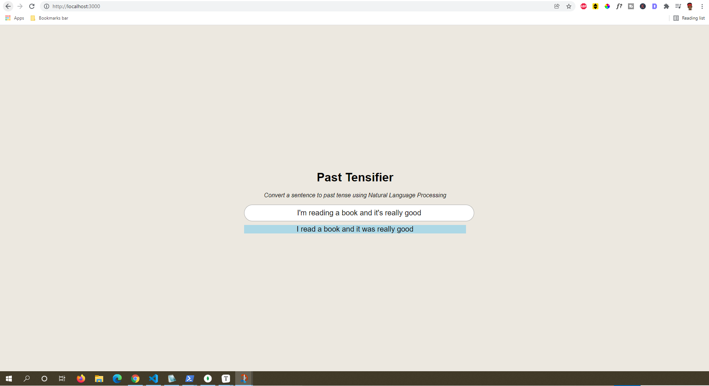

# Past Tensifier

🤖 Node.js app that converts sentences to past tense using natural language processing

## Getting Started

1) Clone this repository
2) Inside the project root directory, run `npm install` to install dependencies
3) To run the app, run `node index.js`
4) Once the app is running, navigate to `http://localhost:3000`

